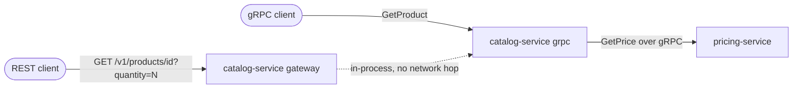

# grpc-catalog-platform

[](https://github.com/sahilkalgutkar/grpc-catalog-platform/actions/workflows/ci.yml)
[](https://codecov.io/gh/sahilkalgutkar/grpc-catalog-platform)
[](codecov.yml)
[](LICENSE)

I built two Go gRPC services around a buf-managed proto contract to show two
different things Kafka-based REST services in my other projects don't:
service-to-service gRPC, and serving one implementation over both gRPC and
REST from the same handler code via grpc-gateway.

## Architecture



- **catalog-service** — owns the in-memory product catalog and serves
  `ProductService` (`GetProduct`, `ListProducts`) two ways at once: natively
  over gRPC on `:9090`, and over REST on `:8080` via grpc-gateway, generated
  straight from the `google.api.http` annotations in
  `proto/catalog/v1/catalog.proto`. `GetProduct` with a `quantity` calls
  pricing-service over gRPC for a quantity-based price; without one, it
  skips that call and returns the plain unit price.
- **pricing-service** — internal-only: `PricingService.GetPrice` is never
  exposed over REST, only called service-to-service. It's the half of the
  demo REST can't show — a plain gRPC client/server pair with no gateway in
  front of it.

Both services share generated proto code from a single `gen/` Go module
(`buf generate`, config in `buf.gen.yaml`) rather than vendoring it into each
service, so the wire contract can't drift between them.

## Why these choices (talking points)

- **One handler, two transports** — the REST gateway is mounted in-process
  against the same `CatalogServer` struct the gRPC listener uses
  (`RegisterProductServiceHandlerServer`, not
  `RegisterProductServiceHandlerFromEndpoint`), so a REST request never
  makes a network hop back into the service's own gRPC port — see the
  comment on `ProductService` in the proto for why.
- **Request ID propagation across the gRPC boundary** — catalog-service's
  pricing client interceptor (`internal/client/pricing_client.go`) forwards
  `x-request-id` from the incoming request onto the outgoing call to
  pricing-service, so pricing-service's own logging interceptor
  (`internal/interceptor/interceptor.go`) can correlate both services' logs
  for one end-to-end request.
- **bufconn for gRPC tests, no real sockets** — both services' tests spin up
  the gRPC server on an in-memory `bufconn` listener rather than a real TCP
  port. catalog-service's tests go one step further and run a fake
  `PricingServiceServer` the same way, so `GetProduct`'s pricing-call logic
  is tested against a real gRPC call with a controllable response, not a
  mocked interface.
- **Quantity is optional, and that's enforced by not calling pricing at
  all** — `GetProduct` without a `quantity` never dials pricing-service,
  rather than calling it with a zero quantity and special-casing the
  response. One fewer network call on the common path, and one fewer way
  for the "no quantity" case to accidentally depend on pricing-service being
  up.

## Running it locally

Requires Docker and Docker Compose.

```bash
docker compose up --build
```

Try it:

```bash
curl http://localhost:8080/v1/products
curl http://localhost:8080/v1/products/p1
curl "http://localhost:8080/v1/products/p1?quantity=50"
```

pricing-service isn't published on a host port — nothing outside the compose
network is meant to reach it directly, matching the "internal-only" design
in its own proto file.

## Development

```bash
cd services/catalog-service   # or services/pricing-service
go vet ./...
go build ./...
go test -race ./...
```

Regenerating the proto code (only needed after editing a `.proto` file):

```bash
buf generate
```

## What's deliberately out of scope

- **catalog-service's product store is in-memory** (`internal/domain`), seeded
  with a handful of products in `main.go` — the interesting thing under test
  is the gRPC/gateway/pricing-client wiring, not a second CRUD layer. A real
  system would back this with Postgres or DynamoDB.
- **No TLS** — both services use insecure gRPC credentials, fine for local
  dev and this demo, not how either would run in production.
- **No Kubernetes manifests** — unlike my other multi-service repos, this one
  only has a docker-compose path; a k8s deployment would need the same kind
  of Service/readiness-probe care documented in `risk-signal-platform`'s
  `infra/k8s/README.md`.
